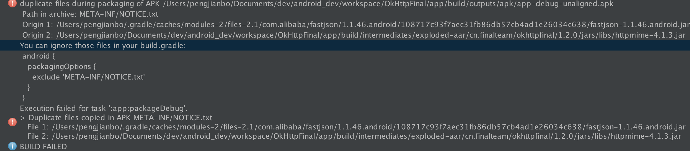

# OkHttpFinal简介
一个对OkHttp封装的简单易用型HTTP请求和文件下载管理框架。更多详情文档请查看[WIKI](https://github.com/pengjianbo/OkHttpFinal/wiki)

* 简化[OkHttp](https://github.com/square/okhttp)使用
* 支持GET,POST,PUT,DELETE,HEAD,PATCH谓词
* 支持Activity和Fragment生命周期结束后终止请求
* 支持Download Manager功能
* 支持文件下载多事件回调
* 支持返回bean对象
* 支持返回json String数据
* 支持返回JsonObject对象
* 支持https请求
* 支持https证书访问
* 支持文件上传
* 支持全局params
* 支持全局header
* 支持http cancel
* ……

#下载OkHttpFinal
下载这个[JAR](https://github.com/pengjianbo/OkHttpFinal/tree/master/downloads) 或者通过Gradle抓取:

```gradle
compile 'cn.finalteam:okhttpfinal:1.2.1'
#带下载管理
compile 'cn.finalteam:okhttpfinal-dm:1.2.1'
```

如果编译的时候出现 这样的错误,请在你项目的build.gralde中加上以下语句

```xml
android {
	packagingOptions {
        exclude 'META-INF/DEPENDENCIES.txt'
        exclude 'META-INF/LICENSE.txt'
        exclude 'META-INF/NOTICE.txt'
        exclude 'META-INF/NOTICE'
        exclude 'META-INF/LICENSE'
        exclude 'META-INF/DEPENDENCIES'
        exclude 'META-INF/notice.txt'
        exclude 'META-INF/license.txt'
        exclude 'META-INF/dependencies.txt'
        exclude 'META-INF/LGPL2.1'
        exclude 'META-INF/ASL2.0'
    }
}
```

##eclipse使用
下载OkHttpFinal对应的[Jar](https://github.com/pengjianbo/OkHttpFinal/tree/master/downloads) 和下载依赖[Extra Jar](https://github.com/pengjianbo/OkHttpFinal/tree/master/downloads/extra) (如果你没使用下载管理SQLiteFinal.jar不需要添加)

##1.2.0更新内容
* 添加PUT,DELETE,HEAD,PATCH谓词
* 支持http cancel
* 全局配置debug模式
* 添加防止公共params和公共header为Null情况
* RequestParams 添加setJSONObject方法（对application/json支持）
* RequestParams 添加setCustomRequestBody方法
* 计算上传/下载网速功能
* ...

##DEMO部分截图
Demo apk:

   
# OkHttpFinal使用方法：
## 请求接口
### 1、在你的Application中添加全局配置（可选）
在这里可以配置：公共请求参数、公共header、请求证书、timeout

```java
Map<String, String> commonParamMap = new HashMap<>();
Map<String, String> commonHeaderMap = new HashMap<>();
OkHttpFinal okHttpFinal = new OkHttpFinal.Builder()
        .setCommenParams(commonParamMap)
        .setCommenHeader(commonHeaderMap)
        .setTimeout(Constants.REQ_TIMEOUT)
        .setDebug(true)
        //.setCertificates(...)
        //.setHostnameVerifier(new SkirtHttpsHostnameVerifier())
		.build();
okHttpFinal.init();
```

### 3、Activity或Frament生命周期结束后销毁页面所有正在执行的请求（建议配置）
父Activity或父Fragment继承HttpCycleContext

* 注：如果你的的adapger中也有请求网络操作，adapter的请求网络的生命周期也应该是fragment或activity的生命周期，大家可以参考demo

```java
//在BaseActivity或BaseFragment中添加字段
protected final String HTTP_TASK_KEY = "HttpTaskKey_" + hashCode();

@Override
public String getHttpTaskKey() {
    return HTTP_TASK_KEY;
}

//在BaseActivity(onDestroy)和BaseFragment(onDestroyView)销毁方法中添加
HttpTaskHandler.getInstance().removeTask(HTTP_TASK_KEY);
```

### 4、发起请求：
请求回调有很多种包括BaseHttpRequestCallback\<T\>、JsonHttpRequestCallback、StringHttpRequestCallback看大家的喜好选择

* 注意：onSuccess这里只是网络请求成功了（也就是服务器返回JSON合法）没有没有分装具体的业务成功与失败，大家可以参考demo去分装自己公司业务请求成功与失败

```java
RequestParams params = new RequestParams(this);
params.put("username", mUserName);
params.put("password", mPassword);
params.put("file", file);
params.put("image", inputstream);
params.putHeader("token", token);
HttpRequest.post(Api.LOGIN, params, new BaseHttpRequestCallback<LoginResponse>() {

//请求网络前
@Override
public void onStart() {
	buildProgressDialog().show();
}

//这里只是网络请求成功了（也就是服务器返回JSON合法）没有没有分装具体的业务成功与失败，大家可以参考demo去分装自己公司业务请求成功与失败
@Override
protected void onSuccess(LoginResponse loginResponse) {
	toast(loginResponse.getMsg());
}

//请求失败（服务返回非法JSON、服务器异常、网络异常）
@Override
public void onFailure(int errorCode, String msg) {
	toast("网络异常~，请检查你的网络是否连接后再试");
}
 
//请求网络结束   
@Override
public void onFinish() {
    dismissProgressDialog();
}
```

##文件上传

```java
File file = new File("/sdcard/DCIM/GalleryFinal/IMG20151201200821.jpg");
String userId = "3097424";
RequestParams params = new RequestParams(this);
params.put("file", file);
params.put("userId", userId);
params.put("token", "NTCrWFKFCn1r8iaV3K0fLz2gX9LZS1SR");
params.put("udid", "f0ba33e4de8a657d");
params.put("sign", "39abfa9af6f6e3c8776b01ae612bc14c");
params.put("version", "2.1.0");
params.put("mac", "8c:3a:e3:5e:68:e0");
params.put("appId", "paojiao_aiyouyou20");
params.put("imei", "359250051610200");
params.put("model", "Nexus 5");
params.put("cid", "paojiao");
String fileuploadUri = "http://uploader.paojiao.cn/avatarAppUploader?userId=" + userId;

HttpRequest.post(fileuploadUri, params, new BaseHttpRequestCallback<UploadResponse>() {
    @Override
    public void onSuccess(UploadResponse uploadResponse) {
        super.onSuccess(uploadResponse);
        Toast.makeText(getBaseContext(), "上传成功：" + uploadResponse.getData(), Toast.LENGTH_SHORT).show();
    }

    @Override
    public void onFailure(int errorCode, String msg) {
        super.onFailure(errorCode, msg);
        Toast.makeText(getBaseContext(), "上传失败", Toast.LENGTH_SHORT).show();
    }

    @Override
    public void onProgress(int progress, long networkSpeed, boolean done) {
        mPbUpload.setProgress(progress);
    }
});
```

##简单文件下载（没有下载管理功能）

```java
String url = "http://219.128.78.33/apk.r1.market.hiapk.com/data/upload/2015/05_20/14/com.speedsoftware.rootexplorer_140220.apk";
File saveFile = new File("/sdcard/rootexplorer_140220.apk");
HttpRequest.download(url, saveFile, new FileDownloadCallback() {
    //开始下砸
    @Override 
    public void onStart() {
        super.onStart();
    }

	//下载进度
    @Override
    public void onProgress(int progress, long networkSpeed) {
        super.onProgress(progress, networkSpeed);
        mPbDownload.setProgress(progress);
        //String speed = FileUtils.generateFileSize(networkSpeed);
    }

	//下载失败
    @Override 
    public void onFailure() {
        super.onFailure();
        Toast.makeText(getBaseContext(), "下载失败", Toast.LENGTH_SHORT).show();
    }

	//下载完成（下载成功）
    @Override 
    public void onDone() {
        super.onDone();
        Toast.makeText(getBaseContext(), "下载成功", Toast.LENGTH_SHORT).show();
    }
});
```

##OKHttpFinal下载文件（下载管理）：
* 添加下载

```java
String url = gameInfo.getUrl();
if (!DownloadManager.getInstance(this).hasTask(url)) {
	DownloadManager.getInstance(this).addTask(url, null);
}
```
* 暂停下载

```java
DownloadManager.getInstance(this).stopTask(info.getUrl());
```
* 继续下载

```java
DownloadManager.getInstance(this).restartTask(info.getUrl());
```
* 添加事件回调

```java
DownloadManager.getInstance(this).addTaskListener(url, new DownloadListener() {
    @Override
    public void onProgress(DownloadInfo downloadInfo) {
        super.onProgress(downloadInfo);
        holder.mTvOperate.setText("暂停");
        holder.mTvDownloadState.setText("下载中");
        holder.mNumberProgressBar.setProgress(downloadInfo.getProgress());
        String downladScale = StringUtils.generateFileSize(downloadInfo.getDownloadLength()) + "/"
                + StringUtils.generateFileSize(downloadInfo.getTotalLength());
        holder.mTvDownloadScale.setText(downladScale);
        holder.mTvDownloadSpeed.setText(StringUtils.generateFileSize(downloadInfo.getNetworkSpeed()));
    }

    @Override
    public void onError(DownloadInfo downloadInfo) {
        super.onError(downloadInfo);
        holder.mTvOperate.setText("继续");
        holder.mTvDownloadState.setText("已暂停");
    }

    @Override
    public void onFinish(DownloadInfo downloadInfo) {
        super.onFinish(downloadInfo);
        holder.mTvDownloadState.setText("下载完成");
        holder.mTvOperate.setText("安装");
    }
});
```
* 添加全局事件回调

```java
DownloadManager.getInstance(this).setGlobalDownloadListener(new DownloadListener());
```
...

# 权限

```xml
<uses-permission android:name="android.permission.INTERNET"/>

<!--在SDCard中创建与删除文件权限  -->
<uses-permission android:name="android.permission.MOUNT_UNMOUNT_FILESYSTEMS"/>
<!-- 往SDCard写入数据权限 -->
<uses-permission android:name="android.permission.WRITE_EXTERNAL_STORAGE"/>
<!--  从SDCard读取数据权限 -->
<uses-permission android:name="android.permission.READ_EXTERNAL_STORAGE"/>
```
如果你用到了toosfinal的一些功能请添加以下权限：

```xml
<!--读取设备信息权限-->
<uses-permission android:name="android.permission.READ_PHONE_STATE" />
<!--获取WIFI权限-->
<uses-permission android:name="android.permission.ACCESS_WIFI_STATE" />
<!--获取手机任务信息（进程,app列表）-->
<uses-permission android:name="android.permission.GET_TASKS"/>
<!-- 检查是否wifi网络 (CrashHanler保存日志信息用到) -->
<uses-permission android:name="android.permission.ACCESS_NETWORK_STATE" />
```

#代码混淆
```properties
#--------------- BEGIN: GSON ----------
-keepattributes Signature
# For using GSON @Expose annotation
-keepattributes *Annotation*
-keepattributes EnclosingMethod
# Gson specific classes
-keep class sun.misc.Unsafe { *; }
-keep class com.google.gson.stream.** { *; }
#--------------- END: GSON ----------
#--------------- BEGIN: okhttp ----------
-keepattributes Signature
-keepattributes *Annotation*
-keep class com.squareup.okhttp.** { *; }
-keep interface com.squareup.okhttp.** { *; }
-dontwarn com.squareup.okhttp.**
#--------------- END: okhttp ----------
#--------------- BEGIN: okio ----------
-keep class sun.misc.Unsafe { *; }
-dontwarn java.nio.file.*
-dontwarn org.codehaus.mojo.animal_sniffer.IgnoreJRERequirement
-dontwarn okio.**
#--------------- END: okio ----------
#--------------- BEGIN: DbHelper ----------
-keep class * extends java.lang.annotation.Annotation { *; }
#--------------- END: DbHelper ----------
#--------------- BEGIN: 数据库模型 ----------
-keep class cn.finalteam.okhttpfinal.* {*;}
-keep class * extends cn.finalteam.okhttpfinal.dm.DownloadInfo { *; }
#--------------- END: 数据库模型 ----------
```

#更新日志
## V1.2.0
* 添加PUT,DELETE,HEAD,PATCH谓词
* 支持http cancel
* 全局配置debug模式
* 添加防止公共params和公共header为Null情况
* RequestParams 添加setJSONObject方法（对application/json支持）
* RequestParams 添加setCustomRequestBody方法
* …… 

## V1.1.0
* 上传文件进度
* 支持https
* https证书访问
* 简单文件下载功能
* 支持多种返回数据结构
* 添加配置全局params
* 添加配置全局header
* ……

非常感谢广大童鞋们提的意见和想法，大家对项目或项目文档哪些意见都可以发邮箱给我

#关于作者
* **QQ:**172340021   
* **QQ群:**218801658  
* **Email:**<pengjianbo@finalteam.cn>

License
-------

    Licensed under the Apache License, Version 2.0 (the "License");
    you may not use this file except in compliance with the License.
    You may obtain a copy of the License at

       http://www.apache.org/licenses/LICENSE-2.0

    Unless required by applicable law or agreed to in writing, software
    distributed under the License is distributed on an "AS IS" BASIS,
    WITHOUT WARRANTIES OR CONDITIONS OF ANY KIND, either express or implied.
    See the License for the specific language governing permissions and
    limitations under the License.