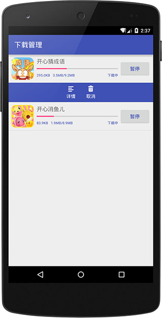

# OkHttpFinal简介
* 简化[OkHttp](https://github.com/square/okhttp)使用
* 支持Activity和Fragment生命周期结束后终止请求
* 添加了DownloadManager功能
* 下载多事件回调
* JSON反射轻松拿到结果
* ……

#下载OkHttpFinal
下载这个[JAR](https://github.com/pengjianbo/OkHttpFinal/tree/master/downloads) 或者通过Gradle抓取:

```gradle
compile 'cn.finalteam:okhttpfinal:1.0.7.4'
#带下载管理
compile 'cn.finalteam:okhttpfinal-dm:1.0.7.4'
```
##1.0.8更新内容
* 上传文件进度
* https证书访问
* ……

##DEMO部分截图
Demo apk:

    
# OkHttpFinal使用方法：
## OkHttpFinal接口请求：
```java
RequestParams params = new RequestParams(this);
params.put("username", mUserName);
params.put("password", mPassword);
params.put("file", file);
params.put("image", inputstream);
params.putHeader("token", token);
HttpRequest.request(Api.LOGIN, params, new BaseHttpRequestCallback<LoginResponse>() {

        @Override
        public void onStart() {
            super.onStart();
            buildProgressDialog().show();
        }

        @Override
        public void onSuccess(LoginResponse loginResponse) {
            super.onSuccess(loginResponse);
            toast("登录成功");
        }

        @Override
        public void onFailed(LoginResponse loginResponse) {
            super.onFailed(loginResponse);
            toast(loginResponse.getMessage());
        }

        @Override
        public void onException(int errorCode, String msg) {
            super.onException(errorCode, msg);
            toast("网络异常~，请检查你的网络是否连接后再试");
        }
        @Override
        public void onFinish() {
            super.onFinish();
            dismissProgressDialog();
        }
    });
```
### Activity或Frament生命周期介绍后销毁页面所有正在执行的请求
父Activity或父Fragment继承HttpCycleContext

```java
//在BaseActivity或BaseFragment中添加字段
protected final String HTTP_TASK_KEY = "HttpTaskKey_" + hashCode();

@Override
public String getHttpTaskKey() {
    return HTTP_TASK_KEY;
}

//在BaseActivity和BaseFragment销毁方法中添加
HttpTaskHandler.getInstance().removeTask(HTTP_TASK_KEY);
```
##OKHttpFinal下载文件：
* 添加下载

    ```java
String url = gameInfo.getUrl();
if (!DownloadManager.getInstance(this).hasTask(url)) {
		DownloadManager.getInstance(this).addTask(url, null);
	}
    ```
* 暂停下载

    ```java
    DownloadManager.getInstance(this).stopTask(info.getUrl());
    ```
* 继续下载

    ```java
    DownloadManager.getInstance(this).restartTask(info.getUrl());
    ```
* 添加事件回调

    ```java
    DownloadManager.getInstance(this).addTaskListener(url, new DownloadListener() {
        @Override
        public void onProgress(DownloadInfo downloadInfo) {
            super.onProgress(downloadInfo);
            holder.mTvOperate.setText("暂停");
            holder.mTvDownloadState.setText("下载中");
            holder.mNumberProgressBar.setProgress(downloadInfo.getProgress());
            String downladScale = StringUtils.generateFileSize(downloadInfo.getDownloadLength()) + "/"
                    + StringUtils.generateFileSize(downloadInfo.getTotalLength());
            holder.mTvDownloadScale.setText(downladScale);
            holder.mTvDownloadSpeed.setText(StringUtils.generateFileSize(downloadInfo.getNetworkSpeed()));
        }

        @Override
        public void onError(DownloadInfo downloadInfo) {
            super.onError(downloadInfo);
            holder.mTvOperate.setText("继续");
            holder.mTvDownloadState.setText("已暂停");
        }

        @Override
        public void onFinish(DownloadInfo downloadInfo) {
            super.onFinish(downloadInfo);
            holder.mTvDownloadState.setText("下载完成");
            holder.mTvOperate.setText("安装");
        }
    });
    ```
* 添加全局事件回调
    ```java
    DownloadManager.getInstance(this).setGlobalDownloadListener(new DownloadListener());
    ```
    ...

#代码混淆
```properties
#--------------- BEGIN: GSON ----------
-keepattributes Signature
# For using GSON @Expose annotation
-keepattributes *Annotation*
-keepattributes EnclosingMethod
# Gson specific classes
-keep class sun.misc.Unsafe { *; }
-keep class com.google.gson.stream.** { *; }
#--------------- END: GSON ----------
#--------------- BEGIN: okhttp ----------
-keepattributes Signature
-keepattributes *Annotation*
-keep class com.squareup.okhttp.** { *; }
-keep interface com.squareup.okhttp.** { *; }
-dontwarn com.squareup.okhttp.**
#--------------- END: okhttp ----------
#--------------- BEGIN: okio ----------
-keep class sun.misc.Unsafe { *; }
-dontwarn java.nio.file.*
-dontwarn org.codehaus.mojo.animal_sniffer.IgnoreJRERequirement
-dontwarn okio.**
#--------------- END: okio ----------
#--------------- BEGIN: DbHelper ----------
-keep class * extends java.lang.annotation.Annotation { *; }
#--------------- END: DbHelper ----------
#--------------- BEGIN: 数据库模型 ----------
-keep class cn.paojiao.okhttpfinal.* {*;}
-keep class * extends cn.finalteam.okhttpfinal.dm.DownloadInfo { *; }
#请求模型
-keep class * extends cn.finalteam.okhttpfinal.ApiResponse { *; }
#--------------- END: 数据库模型 ----------
```

License
-------

    Licensed under the Apache License, Version 2.0 (the "License");
    you may not use this file except in compliance with the License.
    You may obtain a copy of the License at

       http://www.apache.org/licenses/LICENSE-2.0

    Unless required by applicable law or agreed to in writing, software
    distributed under the License is distributed on an "AS IS" BASIS,
    WITHOUT WARRANTIES OR CONDITIONS OF ANY KIND, either express or implied.
    See the License for the specific language governing permissions and
    limitations under the License.